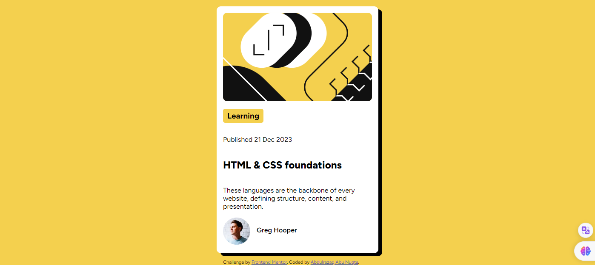

# Frontend Mentor - Blog preview card solution

This is a solution to the [Blog preview card challenge on Frontend Mentor](https://www.frontendmentor.io/challenges/blog-preview-card-ckPaj01IcS). Frontend Mentor challenges help you improve your coding skills by building realistic projects. 

## Table of contents

- [Overview](Solving problems and enhancing front-end development   skills.)
  - [The challenge](Blog preview card solution)
  - [Screenshot] 
- [My process](#my-process)
  - [Built with](HTML - CSS -   Flexbox)
  - [What I learned](boxShadow - )
  - [Useful resources](w3school- almdrasa -EzeroWeb School )
- [Author](Abdulrazaq Abu Nuqta)
- [Acknowledgments](Mohamed Abusrea,Ahmad Fathy, محمد أمين ,  Elzro  )

## Overview

### The challenge

Users should be able to:

- See hover and focus states for all interactive elements on the page

### Screenshot

### Links

- Solution URL: (https://github.com/Abdulrazaq-abunuqta/blog-preview-card-main)
- Live Site URL: (https://blog-preview-card-main-one.vercel.app/)

## My process

### Built with

- Semantic HTML5 markup
- CSS custom properties
- Flexbox
- Mobile-first workflow

### What I learned

Solving problems and enhancing front-end development skills, BoxShadow ,Training on Flexbox,Designing HTML structure.

### Continued development
The areas I want to improve and focus on include writing clean code, enhancing Flexbox proficiency, developing HTML structure design skills, and improving problem-solving and search capabilities.

### Useful resources

- [w3schools](https://www.w3schools.com/css/default.asp) - This helped me for Box Shadow
- [almdrasa](https://almdrasa.com/) - This is an amazing website which helped me finally understand XYZ. I'd recommend it to anyone still learning this concept.

## Author

- Website - [Abdulrazaq Abu Nuqta](www.abdulrazaqabunuqta.com)
- Frontend Mentor - [@Abdulrazaq-Abunuqta](https://www.frontendmentor.io/profile/Abdulrazaq-Abunuqta)
- Twitter - [@apunuqta](https://www.twitter.com/apunuqta)

## Acknowledgments

Solving problems and enhancing front-end development skills, BoxShadow ,Training on Flexbox,Designing HTML structure.
